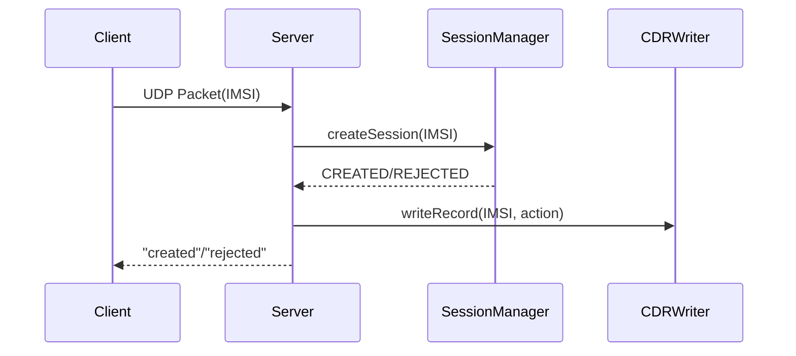

# Мини-PGW

Упрощенная модель сетевого компонента PGW (Packet Gateway)

## Функционал
- Управление сеансами UDP
- HTTP API для мониторинга
- Ведение журнала CDR
- Корректное завершение работы

## Сборка
```bash
mkdir build
cd build
cmake ..
cmake --build . --config Release
```

## Использование
Примеры файлов конфигурации в файле config

## Диаграмма udp запроса


## Структура классов
```mermaid
classDiagram
    class main {
        <<function>>
        Config config
        SessionManager sessionManager
        CdrWriter cdrWriter
        UdpServer udpServer
        HttpServer httpServer
    }

    class Config {
        -m_udpIp: types::Ip
        -m_udpPort: types::Port
        -m_sessionTimeoutSec: types::Seconds
        -m_cdrFile: types::FilePath
        -m_httpPort: types::Port
        -m_gracefulShutdownRate: types::Rate
        -m_logFile: types::FilePath
        -m_logLevel: types::LogLevel
        -m_blackList: types::Blacklist
        -m_error: string
        -m_verification: bool

        -readConfigFile(confPath: string) void
        -validateConfigData() void
        -setDefaultConfig() void
        +Config(string configPath)
    }

    class UdpServer {

    }

    class HttpServer {

    }

    class SessionManager {

    }

    class Session {

    }

    class CdrWriter {

    }

    class Logger {

    }

    class types {
            <<namespace>>
            +Ip : string
            +Port : uint16_t
            +Seconds : uint32_t
            +FilePath : string
            +Rate : uint32_t
            +LogLevel : string
            +Blacklist : list~string~
    }

    main *--> Config : создает
    main *--> SessionManager : создает
    main *--> UdpServer : создает
    main *--> HttpServer : создает
    main *--> CdrWriter  : создает
    SessionManager *--> Session : содержит
    UdpServer --> SessionManager : зависит от
    UdpServer --> CdrWriter : зависит от
    HttpServer --> SessionManager : зависит от
    Config ..> types : использует

    ```
