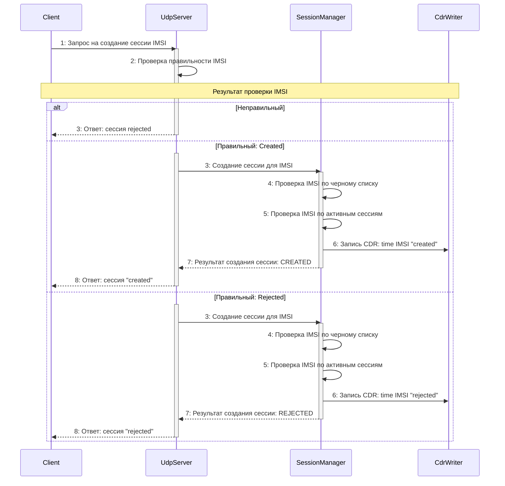
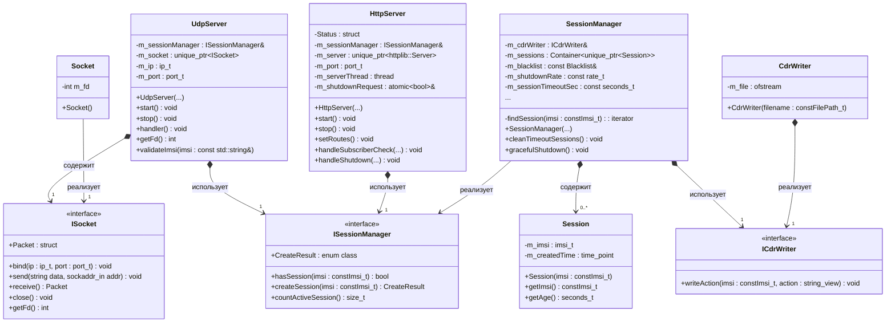

# Мини-PGW

Упрощенная модель сетевого компонента PGW (Packet Gateway)

## Функционал
- Event-driven архитектура на основе `poll()` без потоков для UDP
- Graceful shutdown с контролируемой скоростью удаления сессий
- HTTP API для мониторинга и управления
- CDR журналирование операций с сессиями
- Черный список IMSI для отклонения запросов
- Non-blocking UDP сервер без таймера на ожидание данных
- Конфигурация через JSON с валидацией
- Логирование с поддержкой уровней

## Требования
- C++17 компилятор (g++, clang 6+)
- CMake 3.15+
- Linux (тестировано на Ubuntu 20.04+)

## Сборка
```bash
git clone https://github.com/suaviludius/pgw-project.git
cd pgw-project
mkdir build && cd build
cmake ..
cmake --build . --config Release
```

## Зависимости
Все зависимости загружаются автоматически через CMake `FetchContent`:
- nlohmann/json - парсинг JSON конфигурации
- cpp-httplib - HTTP сервер
- spdlog - логирование
- googletest - unit тесты (только для тестов)

## Конфигурация
Примеры файлов конфигурации лежат в папке config:
- Серверная конфигурация (`configs/pgw_server.json`)
- Клиентская конфигурация (`configs/pgw_client.json`)

## Использование
### Запуск сервера
```bash
# Запуск с конфигурацией по умолчанию
./build/src/pgw_server
# Запуск с указанием конфигурационного файла
./build/src/pgw_server /path/to/config.json
```
### Запуск клиента
```bash
# Отправка одного IMSI
./build/src/pgw_client 001010123456789
# Использование конфигурационного файла
./build/src/pgw_client config.json 001010123456789
```
### HTTP API
```bash
# Проверка статуса абонента
curl "http://localhost:8080/check_subscriber?imsi=001010123456789"
# Инициирование graceful shutdown
curl -X POST http://localhost:8080/stop
```
### Make команды
```bash
make            - Собрать проект (Release)
make configure  - Собрать конфигурацию CMake
make server     - Запустить сервер
make client     - Запустить клиент
make test       - Запустить тесты
make clean      - Удалить build директорию
make rebuild    - Полная пересборка
make help       - Показать эту справку
```

## UDP протокол

Формат запроса
- IMSI: 15 цифр в кодировке ASCII (Пример: "`001010123456789`")

Формат ответа
- "`created`" - сессия создана
- "`rejected`" - сессия отклонена (blacklist или уже существует)

## UML диаграммы
### Обработка UDP запроса


### Структура классов cервера


