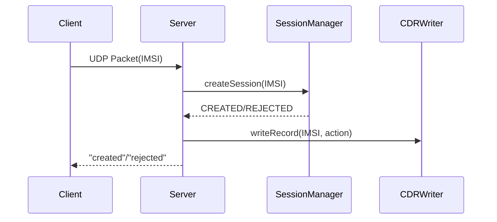

# Мини-PGW

Упрощенная модель сетевого компонента PGW (Packet Gateway)

## Функционал
- Управление сеансами UDP
- HTTP API для мониторинга
- Ведение журнала CDR
- Корректное завершение работы

## Сборка
```bash
mkdir build
cd build
cmake ..
cmake --build . --config Release
```

## Использование
Примеры файлов конфигурации в файле config

## Диаграмма udp запроса
