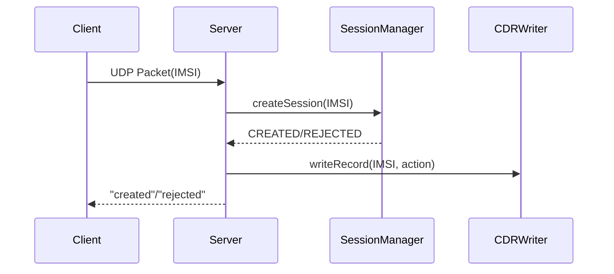

# Мини-PGW

Упрощенная модель сетевого компонента PGW (Packet Gateway)

## Функционал
- Управление сеансами UDP
- HTTP API для мониторинга
- Ведение журнала CDR
- Корректное завершение работы

## Сборка
```bash
mkdir build
cd build
cmake ..
cmake --build . --config Release
```

## Использование
Примеры файлов конфигурации в файле config

## Диаграмма udp запроса


## Структура классов
```mermaid
---
  config:
    class:
      hideEmptyMembersBox: true
---
classDiagram
    class main {
        <<function>>
        Config config
        SessionManager sessionManager
        CdrWriter cdrWriter
        UdpServer udpServer
        HttpServer httpServer
    }

    class Config {
        -m_udpIp: types::Ip
        -m_udpPort: types::Port
        -m_sessionTimeoutSec: types::Seconds
        -m_cdrFile: types::FilePath
        -m_httpPort: types::Port
        -m_gracefulShutdownRate: types::Rate
        -m_logFile: types::FilePath
        -m_logLevel: types::LogLevel
        -m_blackList: types::Blacklist
        -m_error: string
        -m_verification: bool

        -readConfigFile(confPath: types::ConstFilePath)
        -validateConfigData()
        -setDefaultConfig()
        +Config(configPath: types::ConstFilePath)
        +getUdpIp(): types::Ip
        +getUdpPort(): types::Port
        +getSessionTimeoutSec(): types::Seconds
        +getCdrFile(): types::FilePath
        +getHttpPort(): types::Port
        +getGracefulShutdownRate(): types::Rate
        +getLogFile(): types::FilePath
        +getLogLevel(): types::LogLevel
        +getBlacklist(): types::Blacklist
        +getError(): string_view
        +isValid(): bool
    }

    class UdpServer {

    }

    class HttpServer {

    }

    class SessionManager {
        -m_blacklist: types::Blacklist
        -m_sessionTimeoutSec: types::Seconds
        -m_shutdownRate: types::Rate
        -m_sessions: types::Container~unique_ptr~Session~~

        -findSession(imsi: types::ConstImsi): iterator
        -findSession(imsi: ConstImsi): const_iterator
        +SessionManager(blacklist: types::Blacklist&, timeout: types::Seconds, rate: types::Rate)
        +createSession(imsi: types::ConstImsi)
        +removeSession(imsi: types::ConstImsi)
        +gracefulShutdown(rate: types::Rate)
        +cleanTimeoutSessions()
        +hasSession(imsi: types::ConstImsi): bool
        +getSessionCount(): size_t
    }

    class Session {

    }

    class CdrWriter {
        -m_file : std::ofstream

        +CdrWriter()
        +~CdrWriter()
        +writeAction()
    }

    class Logger {
        -m_logger: shared_ptr<spdlog::logger>
        -parse_level(level: types::LogLevel): spdlog::level::level_enum
        +init(logFile: types::ConstFilePath, logLevel: types::LogLevel)
        +trace(message: string_view)
        +debug(message: string_view)
        +info(message: string_view)
        +warn(message: string_view)
        +error(message: string_view)
        +critical(message: string_view)
        +session_created(imsi: string_view)
        +session_rejected(imsi: string_view, reason: string_view)
        +session_deleted(imsi: string_view)
        +udp_request(imsi: string_view, response: string_view)
        +http_request(endpoint: string_view, client_ip: string_view)
    }

    class types {
        <<namespace>>
        Ip = string
        Port = uint16_t
        Seconds = uint32_t
        FilePath = string
        Rate = int64_t
        LogLevel = string

        ConstFilePath = string_view
        ConstLogLevel = string_view
        ConstImsi = string_view
        ConstIp = string_view

        Container = std::unordered_set~~
        Blacklist = Container~ConstImsi~
    }

    main *-- "1" Config : создает
    main *-- "1" SessionManager : создает
    main *-- "1" UdpServer : создает
    main *-- "1"HttpServer : создает
    main *-- "1" CdrWriter  : создает
    SessionManager *-- "0..*" Session : содержит
    UdpServer "1" --> "1" SessionManager : использует
    UdpServer "1" --> "1" CdrWriter : использует
    HttpServer "1" --> "1" SessionManager : использует

    ```
    // dsds
