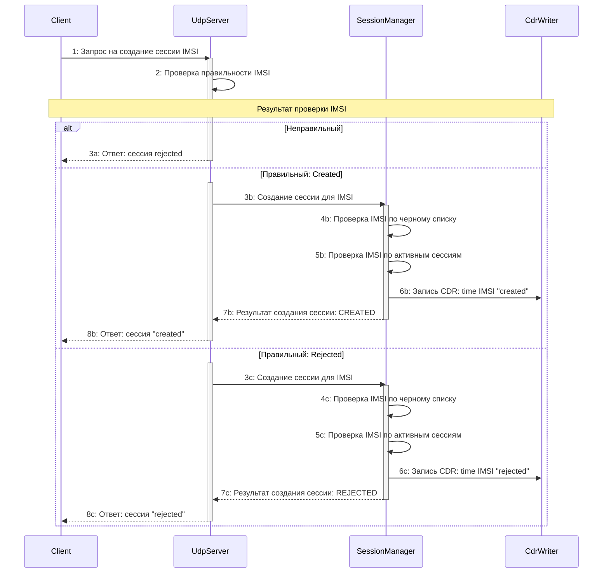
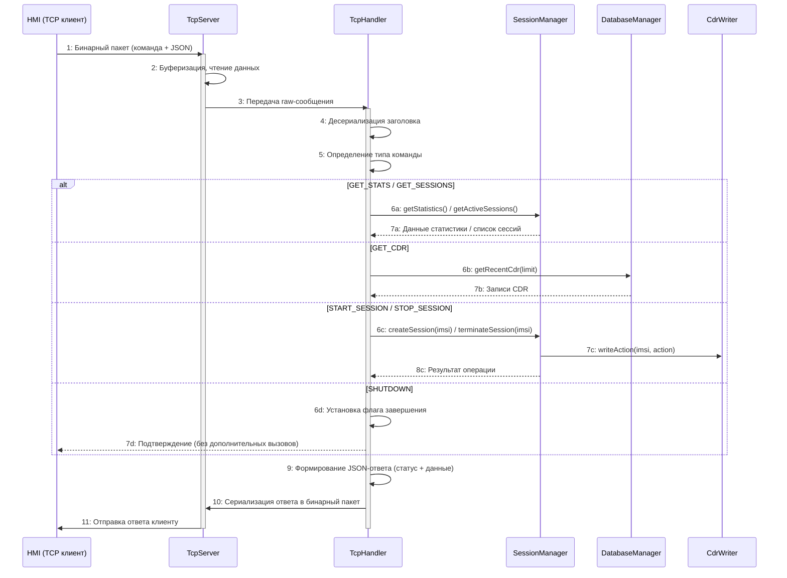
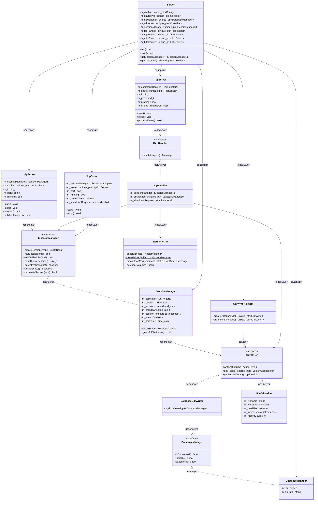

# Мини-PGW

**Упрощенная модель сетевого компонента PGW (Packet Gateway)** с event-driven архитектурой, HTTP API, CDR в SQLite и бинарным TCP-протоколом управления.

## Быстрый старт

```bash
git clone https://github.com/suaviludius/pgw-project.git
cd pgw-project
make docker-start # собрать и запустить всё (сервер + клиент)
```


## Сборка и запуск

### Вариант 1: Docker (рекомендуемый)
```bash
make docker-start            # Собрать и запустить все сервисы
make docker-server           # Запустить сервер
make docker-client           # Запустить клиент
make docker-test             # Запустить тесты
make docker-stop             # Остановить и очистить контейнеры
```

### Вариант 2: Make команды
```bash
make                        # Конфигурация и сборка проекта
make server                 # Запустить сервер
make client                 # Запустить клиент
make test                   # Запустить тесты
make clean                  # Очистить сборку
```

### Вариант 3: Локальная сборка
```bash
mkdir build && cd build                                             # Конфигурация и сборка проекта
cmake .. -DCMAKE_BUILD_TYPE=Release
cmake --build . --parallel $(nproc)

./build/bin/pgw_server configs/pgw_server.json                      # Запуск сервера
./build/bin/pgw_client configs/pgw_client.json "010203040506070"    # Запуск клиента
./build/bin/test_integration                                        # Запуск одного теста
# cd build && ctest -R "^test"                                      # Запуск всех тестов через CTest
rm -rf build                                                        # Очистить сборку
```

**Зависимости**: C++17, CMake 3.15+, Linux, SQLite3 (остальные тянутся через FetchContent)

## Конфигурация

Примеры лежат в `configs/`. Ключевые параметры:

| Параметр | По умолчанию | Описание |
|----------|--------------|----------|
| `udp_port` | 9000 | UDP порт для сессий |
| `tcp_port` | 9090 | TCP порт для команд |
| `http_port` | 8080 | HTTP API |
| `session_timeout_sec` | 30 | Таймаут сессии (сек) |
| `graceful_shutdown_rate` | 10 | Сессий/сек при остановке |
| `log_level` | INFO | TRACE/DEBUG/INFO/WARN/ERROR/CRITICAL |
| `blacklist` | [] | Список IMSI, блокируемых при создании |


## Протоколы

### UDP

- **Формат запроса**: 15 цифр в кодировке ASCII (IMSI)
- **Формат ответа**: `created`/`rejected` (сессия создана/отклонена)

### HTTP API

| Метод | Эндпоинт | Описание |
|-------|----------|----------|
| `GET` | `/check_subscriber?imsi= ...` | Проверка статуса сессии: `active`/`not active` |
| `POST` | `/stop` |  Инициирование graceful shutdown |

```bash
curl "http://localhost:8080/check_subscriber?imsi=001010123456789"
curl -X POST http://localhost:8080/stop
```
### TCP

| Версия | Команда | Статус | Длина пкаета |  Данные   |
| :----: | :-----: | :----: | :----------: | :-------: |
| 1 байт | 1 байт  | 1 байт |   4 байта    |  N байт   |
| `0x01` | `0x00`  | `0x00` | `0x00000000` | json data |

### Команды управления сессиями:

- `GET_STAT` - получение статистики
- `GET_SESSIONS` - список активных сессий
- `GET_CDR` - получить CDR записи
- `START_SESSION`  - принудительно создать сессию
- `STOP_SESSION`  - принудительно завершить сессию
- `SHUTDOWN` - graceful shutdown

### Статусы операций

- `OK` - успешное выполнение
- `ERROR` - общая ошибка
- `INVALID_COMMAND` - неправильная команда
- `INVALID_PARAMS` - неправильные параметры с командой
- `NOT_FOUND` - ресурс не найден


## Тестирование

```bash
make docker-test                        # Запуск контейнера с тестами
make test                               # Запуск всех тетсов
./build/bin/test_integration            # Запуск одного теста
cd build && ctest -R "^test"            # Запуск всех тетсов через CTest
```

Проект содержит набор тестов:
- `test_config` - валидация JSON-конфигурации
- `test_database` - интерфейсные операции с SQLite
- `test_database_cdr_writer` - операции с SQLite на создание таблицы/записи/чтения CDR
- `test_logger` - логирование через spdlog
- `test_session_manager` - создание/удаление сессий, blacklist, таймауты
- `test_tcp_handler` - обработка tcp команд
- `test_tcp_serializer` - создание и парсинг tcp сообщений
- `test_tcp_server` - прием данных с сокета, обработка, формировние ответа
- `test_udp_server` - обработка пакетов, валидация IMSI
- `test_integration` - взаимодействие UDP клиента и сервера


## UML диаграммы

### Обработка UDP запроса


```mermaid
sequenceDiagram
    participant C as Client
    participant US as UdpServer
    participant SM as SessionManager
    participant CW as CdrWriter

    C->>US: 1: Запрос на создание сессии IMSI
    activate US
    US->>US: 2: Проверка правильности IMSI

    Note over C,CW: Результат проверки IMSI
    alt Неправильный
        US-->>C: 3a: Ответ: cессия rejected
        deactivate US
    else Правильный: Created
        activate US
        US->>SM: 3b: Создание сессии для IMSI
        activate SM
        SM->>SM: 4b: Проверка IMSI по черному списку
        SM->>SM: 5b: Проверка IMSI по активным сессиям
        SM->>CW: 6b: Запись CDR: time IMSI "created"
        SM-->>US: 7b: Результат создания сессии: CREATED
        deactivate SM
        US-->>C: 8b: Ответ: cессия "created"
        deactivate US
    else Правильный: Rejected
        activate US
        US->>SM: 3c: Создание сессии для IMSI
        activate SM
        SM->>SM: 4c: Проверка IMSI по черному списку
        SM->>SM: 5c: Проверка IMSI по активным сессиям
        SM->>CW: 6c: Запись CDR: time IMSI "rejected"
        SM-->>US: 7c: Результат создания сессии: REJECTED
        deactivate SM
        US-->>C: 8c: Ответ: cессия "rejected"
        deactivate US
    end
```

### Обработка TCP команд


```mermaid
sequenceDiagram
    participant H as HMI (TCP клиент)
    participant TS as TcpServer
    participant TH as TcpHandler
    participant SM as SessionManager
    participant DB as DatabaseManager
    participant CW as CdrWriter

    H->>TS: 1: Бинарный пакет (команда + JSON)
    activate TS
    TS->>TS: 2: Буферизация, чтение данных
    TS->>TH: 3: Передача raw-сообщения
    activate TH
    TH->>TH: 4: Десериализация заголовка
    TH->>TH: 5: Определение типа команды

    alt GET_STATS / GET_SESSIONS
        TH->>SM: 6a: getStatistics() / getActiveSessions()
        SM-->>TH: 7a: Данные статистики / список сессий
    else GET_CDR
        TH->>DB: 6b: getRecentCdr(limit)
        DB-->>TH: 7b: Записи CDR
    else START_SESSION / STOP_SESSION
        TH->>SM: 6c: createSession(imsi) / terminateSession(imsi)
        SM->>CW: 7c: writeAction(imsi, action)
        SM-->>TH: 8c: Результат операции
    else SHUTDOWN
        TH->>TH: 6d: Установка флага завершения
        TH-->>H: 7d: Подтверждение (без дополнительных вызовов)
    end

    TH->>TH: 9: Формирование JSON-ответа (статус + данные)
    TH->>TS: 10: Сериализация ответа в бинарный пакет
    TS->>H: 11: Отправка ответа клиенту
    deactivate TH
    deactivate TS
```

### Структура классов сервера


```mermaid
classDiagram
    class ISessionManager {
        <<interface>>
        +createSession(imsi) CreateResult
        +hasSession(imsi) bool
        +addToBlacklist(imsi) bool
        +countActiveSession() size_t
        +getActiveSessions() sessions
        +getStatistics() Statistics
        +terminateSession(imsi) bool
    }

    class SessionManager {
        -m_cdrWriter : ICdrWriter&
        -m_blacklist : Blacklist&
        -m_sessions : unordered_map
        -m_shutdownRate : rate_t
        -m_sessionTimeoutSec : seconds_t
        -m_stats : Statistics
        -m_startTime : time_point

        +cleanTimeoutSessions() void
        +gracefulShutdown() void
    }

    class ICdrWriter {
        <<interface>>
        +writeAction(imsi, action) void
        +getRecentRecords(limit) vector~CdrRecord~
        +getRecordCount() optional~int~
    }

    class DatabaseCdrWriter {
        -m_db : shared_ptr~DatabaseManager~
    }

    class FileCdrWriter {
        -m_filename : string
        -m_writeFile : ofstream
        -m_readFile : ifstream
        -m_index : vector~streampos~
        -m_recordCount : int

    }

    class CdrWriterFactory {
        +createDatabase(db) unique_ptr~ICdrWriter~$
        +createFile(filename) unique_ptr~ICdrWriter~$
    }

    class IDatabaseManager {
        <<interface>>
        +isConnected() bool
        +initialize() bool
        +execute(sql) bool
    }


    class DatabaseManager {
        -m_db : sqlite3*
        -m_dbPath : string
    }

    class UdpServer {
        -m_sessionManager : ISessionManager&
        -m_socket : unique_ptr~IUdpSocket~
        -m_ip : ip_t
        -m_port : port_t
        -m_running : bool

        +start() void
        +stop() void
        +handler() void
        +validateImsi(imsi) bool
    }

    class TcpServer {
        -m_commandHandler : ITcpHandler&
        -m_socket : unique_ptr~ITcpSocket~
        -m_ip : ip_t
        -m_port : port_t
        -m_running : bool
        -m_clients : unordered_map

        +start() void
        +stop() void
        +processEvent() void
    }

    class HttpServer {
        -m_sessionManager : ISessionManager&
        -m_server : unique_ptr~httplib::Server~
        -m_port : port_t
        -m_running : bool
        -m_serverThread : thread
        -m_shutdownRequest : atomic~bool~&

        +start() void
        +stop() void
    }

    class ITcpHandler {
        <<interface>>
        +handle(request) Message
    }

    class TcpHandler {
        -m_sessionManager : ISessionManager&
        -m_dbManager : shared_ptr~IDatabaseManager~
        -m_shutdownRequest : atomic~bool~&
    }

    class TcpSerializer {
        +serializer(msg) vector~uint8_t~$
        +deserializer(buffer) optional~Message~$
        +createJsonMsg(command, status, jsonData) Message$
        +getJsonData(msg) json$
    }

    class Server {
        -m_config : unique_ptr~Config~
        -m_shutdownRequest : atomic~bool~
        -m_dbManager : shared_ptr~DatabaseManager~
        -m_cdrWriter : unique_ptr~ICdrWriter~
        -m_sessionManager : unique_ptr~SessionManager~
        -m_tcpHandler : unique_ptr~TcpHandler~
        -m_tcpServer : unique_ptr~TcpServer~
        -m_udpServer : unique_ptr~UdpServer~
        -m_httpServer : unique_ptr~HttpServer~

        +run() int
        +stop() void
        +getSessionManager() ISessionManager&
        +getCdrWriter() shared_ptr~ICdrWriter~
    }

    ISessionManager <|.. SessionManager : реализует
    SessionManager --> ICdrWriter : использует
    ICdrWriter <|.. DatabaseCdrWriter : реализует
    ICdrWriter <|.. FileCdrWriter : реализует
    CdrWriterFactory ..> ICdrWriter : создаёт
    DatabaseCdrWriter --> IDatabaseManager : использует
    IDatabaseManager <|.. DatabaseManager : реализует

    Server --> SessionManager : содержит
    Server --> DatabaseManager : содержит
    Server --> CdrWriterFactory : использует
    Server --> UdpServer : содержит
    Server --> TcpServer : содержит
    Server --> HttpServer : содержит

    UdpServer --> ISessionManager : использует

    TcpServer --> ITcpHandler : использует
    ITcpHandler <|.. TcpHandler : реализует
    TcpHandler --> ISessionManager : использует
    TcpHandler --> ICdrWriter : использует
    TcpHandler --> TcpSerializer : использует

    HttpServer --> ISessionManager : использует
```

