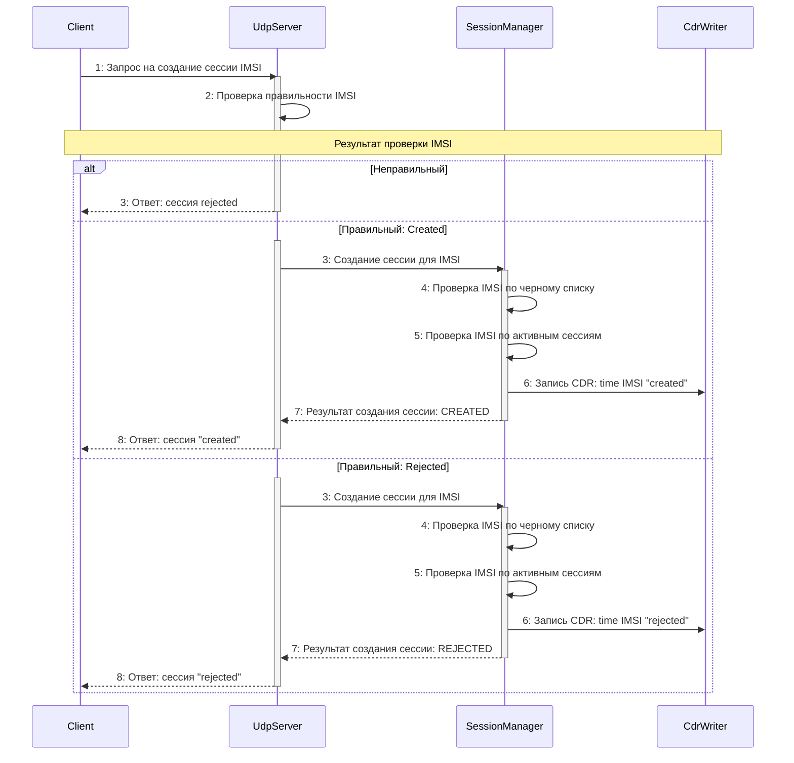
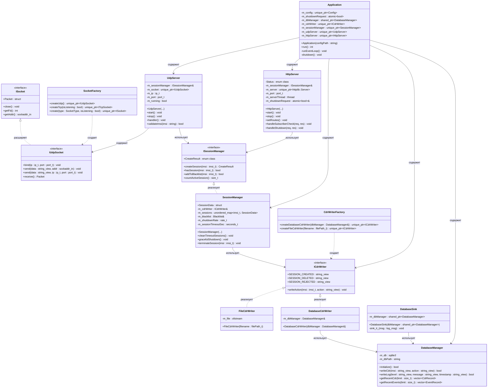

# Мини-PGW

Упрощенная модель сетевого компонента PGW (Packet Gateway)

## Функционал
- Event-driven архитектура на основе `poll()` без потоков для UDP
- Graceful shutdown с контролируемой скоростью удаления сессий
- HTTP API для мониторинга и управления
- CDR журналирование в SQLite (с поддержкой файлового режима)
- Логирование в SQLite через кастомный spdlog sink
- Черный список IMSI для отклонения запросов
- Non-blocking UDP сервер без таймера на ожидание данных
- Инфраструктура для TCP сокетов (готова к расширению)
- Конфигурация через JSON с валидацией
- Логирование с поддержкой уровней

## Требования
- C++17 компилятор (g++, clang 6+)
- CMake 3.15+
- Linux (тестировано на Ubuntu 20.04+)

## Сборка и запуск

### Вариант 1: Docker (рекомендуемый)
```bash
make docker-build            # Собрать образы без тестов
make docker-build-t          # Cобрать образы с тестами
make docker-server           # Запустить сервер
make docker-client           # Запустить клиент
make docker-test             # Запустить тесты
make docker-start            # Собрать и запустить все сервисы
make docker-stop             # Остановить
make docker-logs             # Логи сервера
make docker-shell            # Подключиться к контейнеру
```

### Вариант 2: Локальная сборка
```bash
git clone https://github.com/suaviludius/pgw-project.git
cd pgw-project
mkdir build && cd build
cmake ..
cmake --build . --config Release
```

## Зависимости
Все зависимости загружаются автоматически через CMake `FetchContent`:
- nlohmann/json - парсинг JSON конфигурации
- cpp-httplib - HTTP сервер
- spdlog - логирование
- SQLite3 - хранение CDR записей и логов (системная библиотека)
- googletest - unit тесты (только для тестов)

## Архитектура

### Основные компоненты сервера
- **Application** — оркестратор жизненного цикла приложения (инициализация, event loop, shutdown)
- **UdpServer** — обработка UDP пакетов от абонентов (валидация IMSI, создание сессий)
- **SessionManager** — управление сессиями (создание, удаление, таймауты, graceful shutdown, blacklist)
- **HttpServer** — REST API для мониторинга и управления
- **DatabaseManager** — работа с SQLite (CDR записи, логи событий)
- **DatabaseSink** — кастомный spdlog sink для записи логов в БД
- **ICdrWriter** — интерфейс записи CDR (реализации: `DatabaseCdrWriter`, `FileCdrWriter`)
- **CdrWriterFactory** — фабрика для создания CdrWriter
- **SocketFactory** — фабрика для создания UDP/TCP сокетов
- **ISocket / IUdpSocket / ITcpSocket** — иерархия интерфейсов сокетов


## Конфигурация
Примеры файлов конфигурации лежат в папке config:
- Серверная конфигурация (`configs/pgw_server.json`)
- Клиентская конфигурация (`configs/pgw_client.json`)

## Использование
### Запуск сервера
```bash
# Запуск с конфигурацией по умолчанию
./build/src/pgw_server

# Запуск с указанием конфигурационного файла
./build/src/pgw_server /path/to/config.json
```
### Запуск клиента
```bash
# Отправка одного IMSI
./build/src/pgw_client 001010123456789

# Использование конфигурационного файла
./build/src/pgw_client config.json 001010123456789
```
### HTTP API
Сервер предоставляет следующие эндпоинты:

| Метод | Эндпоинт | Формат | Описание |
|-------|----------|--------|----------|
| `GET` | `/check_subscriber?imsi=<IMSI>` | `text/plain` | Проверка статуса сессии: `"active"` или `"not active"` |
| `POST` | `/stop` | `text/plain` | Инициирование graceful shutdown |

**Примеры:**
```bash
# Проверить статус абонента
curl "http://localhost:8080/check_subscriber?imsi=001010123456789"
# Ответ: active  (или not active)

# Инициировать graceful shutdown
curl -X POST http://localhost:8080/stop
# Ответ: Graceful shutdown request set

# Ошибка — отсутствует параметр imsi
curl "http://localhost:8080/check_subscriber"
# Ответ: Request error: no imsi  (HTTP 400)
```
### Make команды
```bash
make            - Собрать проект (Release)
make configure  - Собрать конфигурацию CMake
make server     - Запустить сервер
make client     - Запустить клиент
make test       - Запустить тесты
make clean      - Удалить build директорию
make rebuild    - Полная пересборка
make help       - Показать эту справку
```

## Тестирование
Проект содержит набор тестов:
- `test_config` — валидация конфигурации
- `test_database` — операции с SQLite (запись CDR, логов, чтение)
- `test_logger` — логирование и DatabaseSink
- `test_session_manager` — создание/удаление сессий, blacklist, таймауты
- `test_udp_server` — обработка пакетов, валидация IMSI
- `test_integration` — интеграционное тестирование компонентов

```bash
# Запуск тестов локально
make test

# Запуск тестов через Docker
make docker-test
```

## UDP протокол

Формат запроса
- IMSI: 15 цифр в кодировке ASCII (Пример: "`001010123456789`")

Формат ответа
- "`created`" - сессия создана
- "`rejected`" - сессия отклонена (blacklist или уже существует)

## UML диаграммы
### Обработка UDP запроса

```mermaid
sequenceDiagram
    participant C as Client
    participant US as UdpServer
    participant SM as SessionManager
    participant CW as CdrWriter

    C->>US: 1: Запрос на создание сессии IMSI
    activate US
    US->>US: 2: Проверка правильности IMSI

    Note over C,CW: Результат проверки IMSI
    alt Неправильный
        US-->>C: 3: Ответ: cессия rejected
        deactivate US
    else Правильный: Created
        activate US
        US->>SM: 3: Создание сессии для IMSI
        activate SM
        SM->>SM: 4: Проверка IMSI по черному списку
        SM->>SM: 5: Проверка IMSI по активным сессиям
        SM->>CW: 6: Запись CDR: time IMSI "created"
        SM-->>US: 7: Результат создания сессии: CREATED
        deactivate SM
        US-->>C: 8: Ответ: cессия "created"
        deactivate US
    else Правильный: Rejected
        activate US
        US->>SM: 3: Создание сессии для IMSI
        activate SM
        SM->>SM: 4: Проверка IMSI по черному списку
        SM->>SM: 5: Проверка IMSI по активным сессиям
        SM->>CW: 6: Запись CDR: time IMSI "rejected"
        SM-->>US: 7: Результат создания сессии: REJECTED
        deactivate SM
        US-->>C: 8: Ответ: cессия "rejected"
        deactivate US
    end
```

### Структура классов сервера

```mermaid
classDiagram
    class ISessionManager {
        <<interface>>
        +CreateResult : enum class
        +createSession(imsi : imsi_t) CreateResult
        +hasSession(imsi : imsi_t) bool
        +addToBlacklist(imsi : imsi_t) bool
        +countActiveSession() size_t
    }

    class SessionManager {
        +SessionData : struct
        -m_cdrWriter : ICdrWriter&
        -m_sessions : unordered_map~imsi_t, SessionData~
        -m_blacklist : Blacklist&
        -m_shutdownRate : rate_t
        -m_sessionTimeoutSec : seconds_t

        +SessionManager(...)
        +cleanTimeoutSessions() void
        +gracefulShutdown() void
        +terminateSession(imsi : imsi_t) void
    }

    class ICdrWriter {
        <<interface>>
        +SESSION_CREATED : string_view
        +SESSION_DELETED : string_view
        +SESSION_REJECTED : string_view
        +writeAction(imsi : imsi_t, action : string_view) void
    }

    class DatabaseCdrWriter {
        -m_dbManager : DatabaseManager&
        +DatabaseCdrWriter(dbManager : DatabaseManager&)
    }

    class FileCdrWriter {
        -m_file : ofstream
        +FileCdrWriter(filename : filePath_t)
    }

    class CdrWriterFactory {
        +createDatabaseCdrWriter(dbManager : DatabaseManager&) unique_ptr~ICdrWriter~
        +createFileCdrWriter(filename : filePath_t) unique_ptr~ICdrWriter~
    }

    class DatabaseManager {
        -m_db : sqlite3*
        -m_dbPath : string
        +initialize() bool
        +writeCdr(imsi : string_view, action : string_view) bool
        +writeLog(level : string_view, message : string_view, timestamp : string_view) bool
        +getRecentCdr(limit : size_t) vector~CdrRecord~
        +getRecentEvents(limit : size_t) vector~EventRecord~
    }

    class DatabaseSink {
        -m_dbManager : shared_ptr~DatabaseManager~
        +DatabaseSink(dbManager : shared_ptr~DatabaseManager~)
        -sink_it_(msg : log_msg) void
    }

    class ISocket {
        <<interface>>
        +Packet : struct
        +close() void
        +getFd() int
        +getAddr() sockaddr_in
    }

    class IUdpSocket {
        <<interface>>
        +bind(ip : ip_t, port : port_t) void
        +send(data : string_view, addr : sockaddr_in) void
        +send(data : string_view, ip : ip_t, port : port_t) void
        +receive() Packet
    }

    class SocketFactory {
        +createUdp() unique_ptr~IUdpSocket~
        +createTcp(isListening : bool) unique_ptr~ITcpSocket~
        +create(type : SocketType, isListening : bool) unique_ptr~ISocket~
    }

    class UdpServer {
        -m_sessionManager : ISessionManager&
        -m_socket : unique_ptr~IUdpSocket~
        -m_ip : ip_t
        -m_port : port_t
        -m_running : bool

        +UdpServer(...)
        +start() void
        +stop() void
        +handler() void
        +validateImsi(imsi : string) bool
    }

    class HttpServer {
        -Status : enum class
        -m_sessionManager : ISessionManager&
        -m_server : unique_ptr~httplib::Server~
        -m_port : port_t
        -m_serverThread : thread
        -m_shutdownRequest : atomic~bool~&

        +HttpServer(...)
        +start() void
        +stop() void
        +setRoutes() void
        +handleSubscriberCheck(req, res) void
        +handleShutdown(req, res) void
    }

    class Application {
        -m_config : unique_ptr~Config~
        -m_shutdownRequest : atomic~bool~
        -m_dbManager : shared_ptr~DatabaseManager~
        -m_cdrWriter : unique_ptr~ICdrWriter~
        -m_sessionManager : unique_ptr~SessionManager~
        -m_udpServer : unique_ptr~UdpServer~
        -m_httpServer : unique_ptr~HttpServer~

        +Application(configPath : string)
        +run() int
        -runEventLoop() void
        -shutdown() void
    }

    Application --> DatabaseManager : содержит
    Application --> ICdrWriter : содержит
    Application --> SessionManager : содержит
    Application --> HttpServer : содержит
    Application --> UdpServer : содержит


    ISessionManager <|.. SessionManager : реализует
    SessionManager --> ICdrWriter : использует

    HttpServer --> ISessionManager : использует

    UdpServer --> ISessionManager : использует
    UdpServer --> IUdpSocket : содержит


    ICdrWriter <|.. DatabaseCdrWriter : реализует
    ICdrWriter <|.. FileCdrWriter : реализует
    CdrWriterFactory ..> ICdrWriter : создает

    DatabaseCdrWriter --> DatabaseManager : использует
    DatabaseSink --> DatabaseManager : использует

    ISocket <|.. IUdpSocket : расширяет
    SocketFactory ..> IUdpSocket : создает

```

